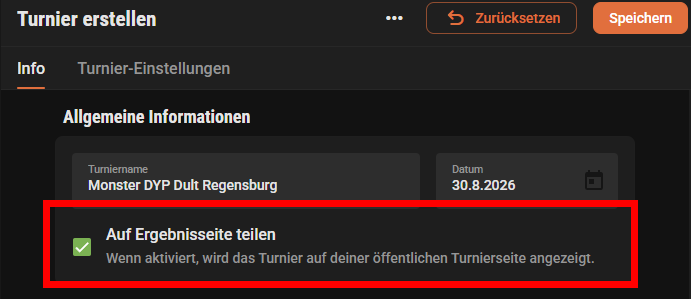
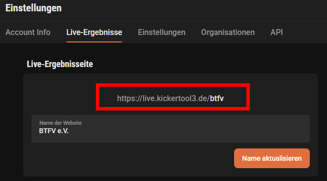

* TOC
{:toc}

# Die BTFV-Tour

Die BTFV-Tour ist eine 2016 vom Bayerischen Tischfußballverband e. V. gestartete Turnierserie.

Über die Saison verteilt richten die bayerischen Vereine Ranglistenturniere aus. Die Ergebnisse dieser Turniere fließen in die **BTFV-Jahresrangliste** ein.

# Challenger ausrichten

Jeder Verein, der Mitglied im BTFV ist, kann ein Ranglistenturnier der BTFV-Tour ausrichten.

Um die Turniere möglichst fair über Bayern und die verschiedenen Vereine zu verteilen, schreibt der BTFV verfügbare Termine zur Bewerbung aus. **Bitte beachtet hierzu die News auf der BTFV-Webseite.**

Während der Bewerbungsphase können sich interessierte Vereine per E-Mail an [challenger@btfv.de](mailto:challenger@btfv.de) um einen Termin bewerben.

Bewerben sich mehrere Vereine für denselben Termin, achtet der BTFV bei der Vergabe insbesondere auf eine **faire regionale Verteilung** sowie eine ausgewogene Verteilung der Turniere zwischen den Vereinen.

Sind nach Ablauf der Bewerbungsfrist noch Termine frei, werden diese anschließend nach Eingang der Bewerbungen vergeben.

Für die Ausrichtung eines Turniers der BTFV-Tour fallen **keine Gebühren an den BTFV** an.

## Welche Turnierart passt zu uns?

Innerhalb der BTFV-Tour können drei verschiedene Arten von Ranglistenturnieren ausgerichtet werden:

| | DTFB-Challenger | BTFV-Challenger | Mini-Challenger |
|---|---|---|---|
| **Ranglistenwertung** | DTFB + BTFV | BTFV | BTFV |
| **Lizenz** | B-Lizenz erforderlich | D-Lizenz (erhält jeder Vereinsspieler automatisch) | keine Lizenz erforderlich |
| **Ausschreibung** | spätestens 6 Wochen vorher | spätestens 4 Wochen vorher | keine Frist |
| **Vorgaben zum Spielmodus** | nach DTFB-Regularien | BTFV-Vorgaben | weitgehend frei |
| **Einzel möglich** | ja | ja | ja |
| **Doppel möglich** | ja | ja | ja |
| **KO-Runde** | nach DTFB-Regularien | verpflichtend | für Ranglistenwertung verpflichtend |
| **BTFV-Wertung** | Doppel 100 %, Einzel 50 % | Doppel 100 %, Einzel 50 % | 50 % |

**Hinweis zur Lizenz:** Bei Mini-Challengern dürfen auch Spieler ohne Lizenz teilnehmen. In die BTFV-Rangliste werden jedoch nur Spieler aufgenommen, die über eine gültige Lizenz verfügen.

# DTFB-Challenger

DTFB-Challenger sind Turniere nach den Vorgaben des Deutschen Tischfußballbundes und werden sowohl für die **DTFB-Rangliste** als auch für die **BTFV-Rangliste** gewertet.

Die detaillierten organisatorischen und sportlichen Vorgaben werden vom DTFB festgelegt und deshalb an dieser Stelle nicht zusätzlich wiederholt.

## Ausschreibung

Die Ausschreibung muss spätestens **6 Wochen vor dem Turniertermin** an [challenger@btfv.de](mailto:challenger@btfv.de) gesendet werden.

Eine Vorlage für die Ausschreibung steht beim DTFB zur Verfügung:

[DTFB-Challenger-Ausschreibung herunterladen](https://dtfb.de/images/dokumente/Turniere/2024_01_Challenger_Ausschreibung_Vorlage.pdf)

Die jeweils aktuellen Regelungen und Dokumente findet ihr direkt beim DTFB:

[DTFB-Dokumente](https://dtfb.de/verband/dokumente)

## Lizenz

Für die Teilnahme an einem DTFB-Challenger ist eine gültige **B-Lizenz** erforderlich.

Den aktuellen Lizenzstatus eines Spielers könnt ihr über die DTFB-Spielersuche prüfen:

[DTFB-Spielersuche](https://dtfb.de/wettbewerbe/turnierserie/spielersuche)

Eine B-Lizenz kann direkt beim DTFB beantragt bzw. erworben werden:

[Lizenz erwerben](https://lizenz.dtfb.de)

## Gebühren

Die Organisationspauschale beträgt **10 € je Teilnehmer und Disziplin**. Junioren zahlen für alle Disziplinen **0 €**.

Die Pauschale ist direkt an den ausrichtenden Verein zu entrichten. Ein zusätzliches Startgeld darf nicht erhoben werden.

# BTFV-Challenger

BTFV-Challenger wurden geschaffen, um den Vereinen bei **Spielmodus, Turniergestaltung und Preisvergabe** mehr Freiheiten zu ermöglichen als bei einem DTFB-Challenger.

Sie werden für die **BTFV-Jahresrangliste** gewertet.

## Lizenz

Für die Teilnahme an einem BTFV-Challenger benötigen die Spieler eine gültige **D-Lizenz**.

Die D-Lizenz erhält jeder Spieler automatisch, sobald er für einen Verein gemeldet ist. Ein gesonderter Antrag ist dafür nicht notwendig.

Ausgeschlossen sind damit ausschließlich Spieler ohne Vereinszugehörigkeit.

## Ausschreibung

Die Ausschreibung muss spätestens **4 Wochen vor Turnierbeginn** per E-Mail an [challenger@btfv.de](mailto:challenger@btfv.de) gesendet werden.

Folgende Angaben müssen enthalten sein:

- Bezeichnung des Turniers als **BTFV-Challenger**
- Name des Veranstalters bzw. Ausrichters
- Kontaktmöglichkeit des Ausrichters, z. B. E-Mail oder Telefonnummer
- Datum und Beginn des Turniers
- Austragungsort mit Name und Adresse
- Anzahl und Typ der Spieltische
- Disziplin: Doppel und/oder Einzel
- Startplätze je Disziplin, sofern die Teilnehmerzahl begrenzt ist
- Meldeschluss mit Datum und Uhrzeit, sofern es einen Meldeschluss gibt
- vorgesehene Preise, z. B. Pokale, Medaillen, Geld- oder Sachpreise

### Vorlage für die Ausschreibung

Für die Ausschreibung stellt der BTFV ein ausfüllbares PDF-Formular bereit. Einfach am Rechner ausfüllen, speichern und per E-Mail an [challenger@btfv.de](mailto:challenger@btfv.de) senden.

[Ausschreibungsformular BTFV-Challenger (PDF zum Ausfüllen)](/assets/pdf/btfv-challenger-ausschreibung.pdf)

Bitte beachtet: Die Ausschreibung muss dem BTFV spätestens **4 Wochen vor Turnierbeginn** vorliegen.

## Spielmodus

Zunächst spielen alle Teilnehmer eine Vorrunde. Diese kann entweder

- **Jeder gegen Jeden** oder
- nach dem **Schweizer System mit Buchholzzahl**

gespielt werden.

Anschließend werden die Endplatzierungen in Playoffs ausgespielt. Dabei ist **Single-KO oder Doppel-KO** möglich.

Bei einem Single-KO wird der dritte Platz ausgespielt.

### Divisionen

Das Teilnehmerfeld kann in bis zu drei Divisionen aufgeteilt werden:

- Profi
- Amateur
- Neuling

Ab **16 Teilnehmern** muss das Teilnehmerfeld in mindestens zwei Divisionen aufgeteilt werden.

Ab **32 Teilnehmern** muss das Teilnehmerfeld in drei Divisionen aufgeteilt werden.

Maßgeblich ist die Anzahl der startenden Teams im Doppel bzw. der startenden Spieler im Einzel.

In einer untergeordneten Division müssen mindestens genauso viele oder mehr Spieler bzw. Teams starten wie in der jeweils darüberliegenden Division.

### Setzung der Playoffs

Die Spieler bzw. Teams werden anhand ihrer Platzierung aus der Vorrunde in die Playoffs gesetzt.

Beispiel bei acht Qualifizierten:

- Platz 1 gegen Platz 8
- Platz 2 gegen Platz 7
- Platz 3 gegen Platz 6
- Platz 4 gegen Platz 5

### Satzmodus

Im Gewinnerfeld der **Profi-Division** wird **Best of 5** gespielt.

Im Entscheidungssatz wird mit Verlängerung gespielt, maximal jedoch bis **8 Tore**.

In allen anderen Feldern wird **Best of 3** mit Verlängerung im Entscheidungssatz bis maximal 8 Tore empfohlen.

## Regeln

Gespielt wird nach den offiziellen Tischfußballregeln des **ITSF**.

## Spielgeräte

Für BTFV-Challenger gelten folgende Anforderungen:

- Es dürfen nur Tische der aktuellen BTFV-Tischpartner eingesetzt werden. Die zugelassenen Tischmodelle, Figuren und Bälle sind in der [Spielordnung, Abschnitt Spielgeräte](https://docs.btfv.de/docs/spielordnung.html#spielgeräte) aufgeführt.
- Es müssen mindestens **zwei Spieltische** zur Verfügung stehen.
- Multitable-Turniere sind zulässig.
- Die Spieltische müssen spätestens **eine Stunde vor Turnierbeginn** vollständig aufgebaut und ausgerichtet sein.
- Gespielt wird mit den zum jeweiligen Tischmodell zugelassenen Bällen.
- Die Bälle werden vom Veranstalter bzw. Ausrichter bereitgestellt.
- Die Spieltische müssen ausreichend ausgeleuchtet sein.

## Gebühren

Die Organisationspauschale beträgt **10 € je Teilnehmer und Disziplin**. Junioren zahlen für alle Disziplinen **0 €**.

Die Pauschale ist direkt an den ausrichtenden Verein zu entrichten. Ein zusätzliches Startgeld darf nicht erhoben werden.

## Preise

Die drei Erstplatzierten jeder Disziplin des **Profifeldes** müssen eine Ehrung erhalten.

Möglich sind beispielsweise:

- Pokale
- Medaillen
- Geldpreise
- vergleichbare Sachpreise

Die Preise werden vom Ausrichter gestellt.

Zusätzliche Sponsorenpreise oder Werbegeschenke können vom Ausrichter dazuaddiert werden.

Ehrungen und Preise in den weiteren Divisionen sind optional.

Bei Nichtanwesenheit bei der Siegerehrung kann der Anspruch auf einen Preis verfallen.

# Mini-Challenger

Mini-Challenger ermöglichen Vereinen, mit sehr wenigen organisatorischen Vorgaben ein Turnier für die BTFV-Tour anzubieten.

Es gibt **keine Bewerbungs- oder Ausschreibungsfrist** und keine zusätzlichen BTFV-Vorgaben beispielsweise zu

- Startgeld
- Preisen
- Anzahl der Spieltische

## Lizenz

Für die Teilnahme an einem Mini-Challenger ist **keine Lizenz erforderlich**.

Damit können auch Spieler teilnehmen, die keinem Verein angehören oder noch keine Lizenz besitzen.

**Für die BTFV-Rangliste werden jedoch ausschließlich Spieler mit gültiger Lizenz berücksichtigt.**

## Spielmodus

Mini-Challenger können als **Einzel oder Doppel** ausgetragen werden.

Für Einzel und Doppel sind folgende Vorrundenmodi möglich:

- **Schweizer System**
- **Jeder gegen Jeden**

Zusätzlich kann ein Mini-Challenger als **Monster-DYP** ausgetragen werden. Beim Monster-DYP wird ausschließlich Doppel gespielt und die Partner werden während der Vorrunde wechselnd zugelost.

## KO-Runde

Damit ein Mini-Challenger für die BTFV-Rangliste gewertet werden kann, muss nach der Vorrunde eine **KO-Runde** zur Ermittlung der Endplatzierungen gespielt werden.

Mini-Challenger ohne KO-Runde können nicht für die Rangliste gemeldet werden.

# Kickertool und Ergebnismeldung

Für **alle Turniere der BTFV-Tour** muss das Kickertool unter **[app.kickertool3.de](https://app.kickertool3.de/)** verwendet werden.

Achtung: Es gibt zwei Kickertool-Versionen parallel. Maßgeblich ist die Adresse mit der **3** (`app.kickertool3.de`); die ältere Version unter `app.kickertool.de` wird nicht mehr weiterentwickelt und ist für die BTFV-Rangliste nicht zugelassen.

Damit die Ergebnisse automatisch verarbeitet und der BTFV-Rangliste zugeordnet werden können, sind folgende Punkte zu beachten:

1. Das Turnier im Kickertool anlegen.
2. Die Turnierart muss im Namen des Turniers enthalten sein:
   - **DTFB-Challenger**
   - **BTFV-Challenger**
   - **Mini-Challenger**
3. Im Kickertool muss **„Auf Ergebnisseite teilen“** aktiviert sein.

   
4. Der öffentliche Ergebnislink des Vereins muss **einmalig** per E-Mail an [challenger@btfv.de](mailto:challenger@btfv.de) gesendet werden. Über diesen Link werden alle Turniere des Vereins erfasst; er muss nur dann erneut gemeldet werden, wenn er sich ändert.

   

Die Ergebnisse werden anschließend automatisiert an den BTFV übermittelt.

Ein zusätzliches Hochladen oder Versenden der Ergebnisse als Datei ist **nicht erforderlich**.

## Meldefristen

Die Übertragung der Ergebnisse läuft automatisch **jeden Montag um 8:00 Uhr**.

Gesonderte Meldefristen gibt es deshalb nicht. Jedes Turnier, das zu diesem Zeitpunkt korrekt benannt und öffentlich freigegeben ist, wird mit dem nächsten Lauf in die Rangliste übernommen.

**Wichtig:** Voraussetzung für die automatische Verarbeitung sind die korrekte Benennung des Turniers und ein öffentlich freigegebener Ergebnislink.

Bei Mini-Challengern ist zusätzlich eine **KO-Runde verpflichtend**, damit das Ergebnis in die Rangliste übernommen werden kann.

# BTFV-Jahresrangliste

## Wertungszeitraum

Eine Ranglistensaison läuft jeweils vom

**1. Dezember bis zum 30. November des Folgejahres.**

Die Saison 2026 läuft beispielsweise vom **01.12.2025 bis 30.11.2026**.

## Wertung

Für die Jahresrangliste werden die **10 besten Turnierergebnisse** eines Spielers berücksichtigt.

Dabei gelten folgende Wertungsfaktoren:

- **Doppel:** 100 %
- **Einzel:** 50 %
- **Mini-Challenger:** 50 %

Bei einem Mini-Challenger gilt die reduzierte Wertung unabhängig davon, ob Einzel oder Doppel gespielt wird.

Die tatsächlich erzielbaren Ranglistenpunkte hängen unter anderem von

- der Anzahl der Teilnehmer,
- der erreichten Platzierung und
- dem für die jeweilige Turnierart geltenden Wertungsfaktor

ab.

Die Berechnung erfolgt nach folgender Formel:

`VERTEILUNG(POW(MAX(MIN(n, 200), 10) * 10, 0.7), p, n, m)`

Dabei gilt:

- `n` = Anzahl der Teilnehmer
- `p` = Platzierung
- `m` = Multiplikator der jeweiligen Wertung

## Landesmeisterschaft

Die **Bayerische Landesmeisterschaft** fließt nicht in die Jahresrangliste ein.

Bei der Landesmeisterschaft geht es unabhängig von der Rangliste darum, einmal im Jahr die Bayerischen Landesmeister auszuspielen.

# Preise der Jahresrangliste

## Offene Wertung

| Platz | Preis |
|---:|---:|
| 1. | Leonhart Tisch |
| 2. | 200 € |
| 3. | 100 € |
| 4. | 80 € |
| 5. | 70 € |
| 6. | 60 € |
| 7. | 50 € |
| 8. | 40 € |
| 9. | 30 € |
| 10. | 20 € |

## Damenwertung

| Platz | Preis |
|---:|---:|
| 1. | 100 € |
| 2. | 60 € |
| 3. | 40 € |

Die Turniere der BTFV-Tour sind offene Turniere. Alle teilnehmenden Spielerinnen werden daher automatisch zusätzlich in der Damenwertung geführt. Eine gesonderte Meldung oder Anmeldung ist nicht erforderlich.

Spielerinnen, die in beiden Wertungen einen Preis erreichen, erhalten die Preise aus der offenen Wertung und aus der Damenwertung nebeneinander.

## Juniorenförderung

Junioren erhalten vom BTFV **20 €**, wenn sie innerhalb der jeweiligen Ranglistensaison an mindestens **drei Turnieren der BTFV-Tour** teilgenommen haben.

Als Junior gilt, wer nach den Regularien des DTFB in einer Juniorenkategorie (**U19, U16 oder U13**) startberechtigt ist. 

## Auszahlung

Die Endergebnisse der Jahresrangliste werden nach dem letzten Turnier der Saison auf der **BTFV-Webseite** veröffentlicht.

Am selben Tag kontaktiert der BTFV die Gewinner per E-Mail – ausschließlich über die beim Verband hinterlegten Kontaktdaten. So ist sichergestellt, dass die Preise an die tatsächlich berechtigten Personen gehen.

Damit das möglich ist, ist der jeweilige **Vereinsvorstand** dafür verantwortlich, für seine Mitglieder eine gültige **E-Mail-Adresse** zu hinterlegen – idealerweise zusätzlich eine **Telefonnummer**.

Erhält ein Gewinner keine E-Mail, ist er selbst dafür verantwortlich, sich beim BTFV unter [challenger@btfv.de](mailto:challenger@btfv.de) zu melden. Die Fristen bleiben davon unberührt.

Ab der Veröffentlichung der Ergebnisse haben die Gewinner **vier Wochen** Zeit, ihren Preis anzunehmen.

Erfolgt innerhalb dieser Frist keine Rückmeldung, gehen die nicht beanspruchten Preise dem BTFV als **Spende** zu.

# Sponsoring

Die BTFV-Tour wird unterstützt von **Original Leonhart** – Kickertische und Tischfußball, Made in Germany.

